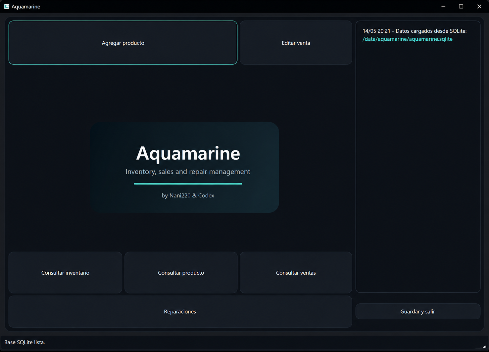

# Aquamarine

Aquamarine es una aplicación de escritorio desarrollada con Qt Widgets y Visual Studio para la gestión de inventario, ventas, pagos a proveedores y seguimiento de reparaciones.

Fue diseñada como una solución local-first para pequeños y medianos negocios, priorizando simplicidad, portabilidad y control local de los datos.

Esta versión pública fue preparada como una base limpia y personalizable para futuros desarrollos:

* Branding neutro y adaptable
* Código organizado y documentado
* Base de datos SQLite local
* Arquitectura portable sin dependencias de servidor
* Estructura preparada para personalización y extensión

## Captura de pantalla



---

## Funciones principales

* Alta, edición, búsqueda y eliminación de productos
* Búsqueda por SKU o código de barras
* Registro y seguimiento de ventas
* Gestión de reparaciones
* Seguimiento de pagos a proveedores
* Herramientas administrativas avanzadas para SQLite
* Persistencia local mediante SQLite
* Funcionamiento completamente offline
* Arquitectura portable orientada a escritorio

---

## Tecnologías

* C++
* Qt 6 Widgets
* SQLite
* Visual Studio 2022 / MSVC

---

## Estructura del proyecto

```text
aquamarine/
|-- Aquamarine.slnx
|-- README.md
|-- LEEME.md
|-- .gitignore
|-- Screenshots/
`-- Aquamarine/
    |-- main.cpp
    |-- ProyectoAquamarine.cpp
    |-- ProyectoAquamarine.h
    |-- ProyectoAquamarine.ui
    |-- producto.*
    |-- venta.*
    |-- reparacion.*
    |-- inventario.*
    `-- database_manager.*
```

---

## Compilación

### Requisitos

* Windows 10 o superior
* Visual Studio 2022 con MSVC
* Qt 6 para MSVC 2022

### Pasos

1. Abrir `Aquamarine.slnx`
2. Seleccionar la configuración `Release` o `Debug`
3. Compilar la solución desde Visual Studio o mediante MSBuild

---

## Versión portable

El paquete Release incluye:

* Ejecutable principal
* DLLs requeridas por Qt
* Plugins de plataforma
* Drivers SQLite

Para distribuir la aplicación, comparte la carpeta portable completa o el archivo ZIP disponible en Releases.

---

## Base de datos SQLite

Aquamarine utiliza una base de datos SQLite local.

Por defecto intenta almacenar la base en:

```text
Documents/Aquamarine/aquamarine.sqlite
```

Si la carpeta Documentos no está disponible, utiliza automáticamente la ubicación de datos de aplicación proporcionada por Windows.

### Información almacenada

El archivo `.sqlite` contiene:

* Productos
* Ventas
* Reparaciones
* Estructura de tablas

Si el archivo es eliminado, la aplicación generará automáticamente una nueva base vacía durante el próximo inicio.

---

## Herramientas administrativas

Aquamarine incluye un panel interno para ejecutar consultas SQL manualmente.

### Atajo

```text
Ctrl + Alt + S
```

### Ubicación de la contraseña

Archivo:

```text
ProyectoAquamarine.cpp
```

Función:

```cpp
requestAdminAccess()
```

### Consultas de ejemplo

```sql
SELECT * FROM productos;
SELECT * FROM productos WHERE codigo_barras = '7790000000000';
SELECT * FROM ventas;
SELECT * FROM reparaciones;
SELECT * FROM productos WHERE stock <= 3;
DELETE FROM ventas WHERE id = 1;
```

---

## Personalización

### Branding y logo

El banner principal se genera desde:

```text
Aquamarine/ProyectoAquamarine.cpp
```

Función:

```cpp
renderBrandLogo()
```

Puede personalizarse modificando colores, textos, formas o reemplazando completamente el renderizado.

### Ruta de la base de datos

Configurada en:

```cpp
loadData()
```

### Contraseña administrativa

Configurada en:

```cpp
requestAdminAccess()
```

### Fórmula de precios

Ubicada en:

```text
Aquamarine/producto.cpp
```

Función:

```cpp
Producto::calcularPrecioML()
```

---

## Organización del código

### ProyectoAquamarine.*

* Interfaz gráfica
* Eventos y navegación
* Validaciones
* Actualización visual

### producto.*

* Modelo de producto
* Lógica de precios

### venta.*

* Modelo de ventas

### reparacion.*

* Modelo de reparaciones

### inventario.*

* Lógica principal del negocio
* Gestión en memoria

### database_manager.*

* Persistencia SQLite

---

## Posibles extensiones futuras

* Sistema de usuarios y permisos
* Exportación CSV y Excel
* Personalización avanzada de branding
* Archivos externos de configuración
* Filtros avanzados
* Sincronización en la nube
* Soporte multi-negocio

---

## Seguridad

* Utiliza almacenamiento SQLite local
* No requiere conexión a Internet
* No depende de servicios externos
* La base de datos puede recrearse automáticamente si falta

---

## Licencia y uso

Este proyecto está pensado como una base personalizable para futuras implementaciones.

Antes de utilizarlo en entornos comerciales se recomienda revisar:

* Branding y logotipos
* Contraseña administrativa
* Fórmulas de precios
* Datos de ejemplo
* Rutas locales o información sensible

---

## Créditos

Desarrollado por NaniLabs.

Proyecto realizado con fines de aprendizaje, experimentación y desarrollo de aplicaciones de escritorio utilizando C++, Qt y SQLite.
