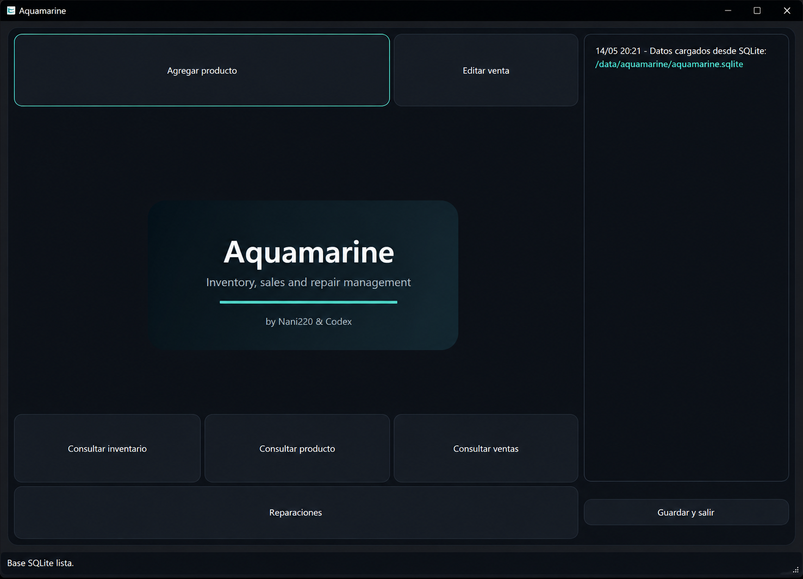

# Aquamarine

Aquamarine is a desktop application built with Qt Widgets and Visual Studio for managing inventory, sales, supplier payments and repair tracking for small and medium-sized businesses.

This public version is designed as a cleaner and more customizable base:
- neutral and adaptable branding
- function-level documented code
- local SQLite database without requiring a server
- project structure ready for customization and GitHub publishing



---

## Main Features

- Create, edit, search and delete products
- Search by SKU or numeric barcode
- Sales registration and tracking
- Supplier payment tracking
- Repair management with customer and repair data
- Hidden SQLite admin panel
- Local SQLite persistence
- Portable desktop-oriented architecture

---

## Technologies

- C++
- Qt 6 Widgets
- SQLite
- Visual Studio 2022 / MSVC

---

## Project Structure

```text
aquamarine/
|-- Aquamarine.slnx
|-- README.md
|-- LEEME.md
|-- .gitignore
|-- Screenshots/
`-- Aquamarine/
    |-- main.cpp
    |-- ProyectoAquamarine.cpp
    |-- ProyectoAquamarine.h
    |-- ProyectoAquamarine.ui
    |-- producto.*
    |-- venta.*
    |-- reparacion.*
    |-- inventario.*
    `-- database_manager.*
```

---

## How to Build

### Requirements

- Windows 10 or newer
- Visual Studio 2022 with MSVC compiler
- Qt 6 for MSVC 2022

### Steps

1. Open `Aquamarine.slnx`
2. Select `Release` or `Debug`
3. Build the solution using Visual Studio or MSBuild

---

## Portable Release

The repository release package contains:

- the executable
- required Qt DLLs
- platform plugins
- SQLite drivers

To distribute the application, share the full portable release folder or the packaged ZIP from the Releases section.

---

## SQLite Database

The application uses a local SQLite database.

By default, it attempts to store the database in the user's Documents folder:

```text
Documents/Aquamarine/aquamarine.sqlite
```

If the Documents folder is unavailable, the application falls back to the Windows application data location.

### What the database stores

The `.sqlite` file contains:
- product data
- sales
- repair records
- table structure

If deleted, the application automatically creates a new empty database on the next startup.

---

## Hidden Admin Panel

Aquamarine includes an internal SQL execution panel.

### Shortcut

```text
Ctrl + Alt + S
```

### Password location

Defined inside:

```text
ProyectoAquamarine.cpp
```

Function:

```cpp
requestAdminAccess()
```

### Example queries

```sql
SELECT * FROM productos;
SELECT * FROM productos WHERE codigo_barras = '7790000000000';
SELECT * FROM ventas;
SELECT * FROM reparaciones;
SELECT * FROM productos WHERE stock <= 3;
DELETE FROM ventas WHERE id = 1;
```

---

## Common Customization Points

### Branding and Logo

The main visual banner is rendered in:

```text
Aquamarine/ProyectoAquamarine.cpp
```

Function:

```cpp
renderBrandLogo()
```

You can customize colors, text, shapes or replace the generated banner completely.

---

### Database Path

Configured inside:

```cpp
loadData()
```

---

### Admin Password

Configured inside:

```cpp
requestAdminAccess()
```

---

### Marketplace / Reference Price Formula

Located in:

```text
Aquamarine/producto.cpp
```

Function:

```cpp
Producto::calcularPrecioML()
```

---

## Code Organization

- `ProyectoAquamarine.*`
  - UI rendering
  - button events
  - screen management
  - validation
  - visual refresh

- `producto.*`
  - product model
  - pricing logic

- `venta.*`
  - sales model

- `reparacion.*`
  - repair model

- `inventario.*`
  - core business logic
  - in-memory storage

- `database_manager.*`
  - SQLite persistence layer

---

## Ideas for Extension

- user accounts and permissions
- CSV or Excel export
- image-based branding
- external configuration files
- advanced filters by customer, date or status
- cloud sync support
- multi-business support

---

## Safety Notes

- Uses local SQLite storage only
- Does not require internet access
- No external server dependency
- Database is automatically recreated if missing

---

## License and Usage

This repository is intended as a customizable base project.

Before publishing or deploying commercially, review:
- branding and logos
- admin password
- pricing formulas
- sample data
- local paths or personal information

---

## Credits

Made by Nani220 & Codex.
